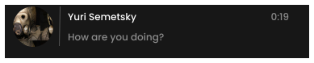

# Notification System from S.T.A.L.K.E.R

Welcome to the S.T.A.L.K.E.R Notification System project! This repository contains a custom notification system inspired by the S.T.A.L.K.E.R, implemented in Unreal Engine 4 (UE4) with a stunning 4K graphical user interface (GUI).



## Table of Contents
- [Introduction](#introduction)
- [Features](#features)
- [Installation](#installation)
- [Usage](#usage)
- [Customization](#customization)
- [Contributing](#contributing)
- [License](#license)

## Introduction

This project aims to recreate the iconic notification system from S.T.A.L.K.E.R in Unreal Engine 4. It features high-resolution 4K graphics to provide a modern and visually appealing user experience. The notification system can be integrated into any UE4 project, enhancing the way notifications are presented to the player.

## Features

- **High-Resolution 4K GUI**: Enjoy crisp and clear notifications with 4K graphics.
- **Customizable Notifications**: Easily customize the look, feel, and behavior of notifications to suit your project's needs.
- **Integration with UE4**: Seamless integration with Unreal Engine 4 for easy use in your game.
- **Inspired by S.T.A.L.K.E.R**: Authentic design inspired by the S.T.A.L.K.E.R.

## Installation

To use the S.T.A.L.K.E.R Notification System in your Unreal Engine 4 project, follow these steps:

1. **Clone the Repository**:
    
    ```
    git clone https://github.com/shulgastanslv/notification_system.git
    ```
    
2. **Copy Files to Your Project**
Copy the `Content/NotificationSystem` of the cloned repository into your UE4 project's folder
3. Add the `AC_Notification Component` to your character, where you can specify various parameters for using the notification functionality.

## Usage

## Customization

You can customize the notification system to better fit your project's aesthetics and requirements:

- **Modify the UI Elements**:
Open the `WB_Notification` blueprint and adjust the UI elements to your liking.
- **Change Notification Behavior**:
Customize the behavior of notifications by modifying the blueprint logic. You can change how long notifications are displayed, their animations, and more.

## Contributing

Contributions are welcome! If you have any ideas, suggestions, or bug fixes, please open an issue or submit a pull request. Make sure to follow the project's coding standards and guidelines.
